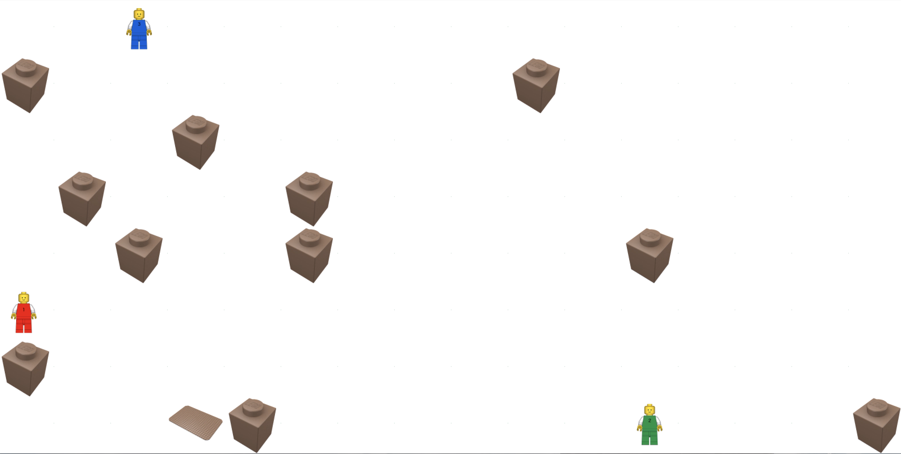

# ScaSMATA
Scalable Situated Multi-Agent Task Allocation
## What is ScaSMATA ?

ScaSMATA is a library of algorithms which aim at allocating some tasks to some situated agents.

We have implemented our prototype with the
[Scala](https://www.scala-lang.org/) programming language and the
[Akka](http://akka.io/) toolkit. The latter, which is based on the
actor model, allows us to fill the gap between the specification and
its implementation.

In order to illustrate the situated multi-agent task allocation problem,
we consider the abstract application called "Packet-World". Agents are 
situated, they are explicitly placed in an environment, i.e a two dimensional 
grid consisting of packages and destinations. Some packets are scattered 
over the rectangular grid.

A job is the set of tasks of the agents to deliver all packets in the
world. An agent can pick up a packet and put it down. The job efficiency 
represents the number of steps, packet manipulations and message exchanges. 
The "heavy packets" must be manipulated simultaneously by at most two agents. 

## Requirements

In order to run the demonstration you need:

- the Java virtual machine [JVM 1.8.0_60](http://www.oracle.com/technetwork/java/javase/downloads/index.html).

In order to compile the code you need:

- the programming language [Scala 2.12.4](http://www.scala-lang.org/download/);

- the interactive build tool [SBT 1.2.1](http://www.scala-sbt.org/download.html).

## Usage

    java -jar ScaSMATA-assembly-X.Y.jar

## Installation

<!--- https://git-scm.com/book/fr/v2/Utilitaires-Git-Sous-modules -->

Clone

    git clone https://github.com/maximemorge/ScaSMATA
    git submodule init
    git submodule update

Compile

    sbt compile

then

    sbt 
    sbt:ScaSMATA> run org.scasmata.util.Main

and eventually

    sbt assembly

## Authors

Copyright (C) Maxime MORGE 2019

Additional contributors: 
- Quentin BRIAND
- Florian LECOINTE

## License

This program is free software: you can redistribute it and/or modify it under the terms of the
GNU General Public License as published by the Free Software Foundation, either version 3 of the License,
or (at your option) any later version.

This program is distributed in the hope that it will be useful, but WITHOUT ANY WARRANTY;
without even the implied warranty of MERCHANTABILITY or FITNESS FOR A PARTICULAR PURPOSE.
See the GNU General Public License for more details.

You should have received a copy of the GNU General Public License along with this program.
If not, see <http://www.gnu.org/licenses/>.
